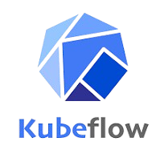

  
  

# Google Summer of Code 2024 with Kubeflow 

## About Kubeflow Organization 
Kubeflow is an open-source platform designed to streamline the deployment, orchestration, and management of machine learning workflows on Kubernetes. It empowers data scientists and engineers to efficiently create, train, and deploy scalable machine learning models in a consistent, reproducible manner. With a comprehensive suite of integrated tools, such as Jupyter notebooks for experimentation, TensorFlow Serving for model deployment, and Katib for hyperparameter optimization, Kubeflow enables seamless collaboration and operationalization within Kubernetes environments. Its cloud-native architecture simplifies the management of the entire machine learning lifecycle, from initial experimentation to full-scale production deployment, supporting both flexibility and scalability in machine learning operations.

## Contributor Information
* Name - Hansini Karunarathne
* Universtiy - University of Moratuwa, Sri Lanka
* GitHub - [hansinikarunarathne](https://github.com/hansinikarunarathne)
* Social Profiles
  - [LinkedIn](www.linkedin.com/in/hansini-karunarathne)
  - [Medium](https://medium.com/@hansini.20)

## Mentors Information
* [Julius von Kohout](https://github.com/juliusvonkohout)

## Project Goals
Through the project it aims to provide solutions to below tasks related to [kubeflow manifests](https://github.com/kubeflow/manifests) and [models-web-app](https://github.com/kserve/models-web-app) repositories.
1. create proper issue template and PR template for the Kubeflow manifest repo
2. automte the scanning procedure to Common Vulnerabilities and Exposure(CVE) for docker images in Kubeflow manifest repo
3. Provide solution to close inactive PRs from kubeflow manifest repo
4. Provide proper formatting guidelines and tools to fromat python, bash and yaml files in kubeflow manifest repo
5. Consolidate Kubeflow manifests tests
6. Provide mecahnism to support networkpolicies in Kind
7. Kserve web application improvements
8. Enable autoscaling and istio support for Raycluster 

## Contributions
1. Created issue template and PR template for the kubeflow manifests repo and did requested chnages on those templates.
> [PR#2708 : Creating Issue templates](https://github.com/kubeflow/manifests/pull/2708) 
> [PR#2722 : Create PR template](https://github.com/kubeflow/manifests/pull/2722) 
> [PR#2726 : Changed the checkbox style](https://github.com/kubeflow/manifests/pull/2726) 
> [PR#2749 : Fix requested changes in pr issue templates ](https://github.com/kubeflow/manifests/pull/2749) 
> [PR#2859 : add kubeflow installation guide to issue report](https://github.com/kubeflow/manifests/pull/2859) 
2.  Created a python script to automate the scanning of security vulanarabilies in docker images of Kubeflow manifest repo and created a github action to run it automatically when a PR gets merged to master.
> [PR#2731 : Create security scan script](https://github.com/kubeflow/manifests/pull/2731) 
> [PR#2758 : Convert trivy_scan.sh into python](https://github.com/kubeflow/manifests/pull/2758) 
> [PR#2764 : Improve the trivy CVE scanning output](https://github.com/kubeflow/manifests/pull/2764) 
> [PR#2860 : Adjust the Trivy scanning workflow to upload artifacts](https://github.com/kubeflow/manifests/pull/2860) 
3. Created a github action using stale action to close inactive PRs and issues in Kubeflow manifest repo
> [PR#2760 : Create stale.yaml](https://github.com/kubeflow/manifests/pull/2760) 
4. Created github action to format  python, bash and yaml files in kubeflow manifest repo and provide guidelines to correct those linting issues in github action itself.
> [PR#2774 : Introduce proper formatting on python ,bash and yaml files](https://github.com/kubeflow/manifests/pull/2774) 
> [PR#2803 : Proper message display when no bash, python and YAML files changed in the PR](https://github.com/kubeflow/manifests/pull/2803) 
> [PR#2823 : fix issue of trying to linting deleted files in PR](https://github.com/kubeflow/manifests/pull/2823) 
> [PR#2825 : fix issue with linting of YAML files](https://github.com/kubeflow/manifests/pull/2825) 
5. Consolidate Kubeflow manifests tests
> [PR#2805 : https://github.com/kubeflow/manifests/pull/2805](https://github.com/kubeflow/manifests/pull/2805) 
6. First used calico to enable networkpolicy support for the Kind cluster in the PR [Install calico for tests](https://github.com/kubeflow/manifests/pull/2820) In later new version of Kind is introduced with the support for the netwokrpolicies. Then did related changes for that.
> [PR#2843 : Change kind version and kubernetes version to support networkpolicies](https://github.com/kubeflow/manifests/pull/2843) 
7. Improving the Kserve web application
> [PR#95 : add serving runtime support](https://github.com/kserve/models-web-app/pull/95) 
> [PR#96 : Fix displaying MLFlow predictors](https://github.com/kserve/models-web-app/pull/96) 
8. Enabled autoscaling and enabled istio support for Raycluster 

> [PR#2821 : change ray version and enable auto scaling](https://github.com/kubeflow/manifests/pull/2821) 
> [PR#2805 : Enable istio support for ray](https://github.com/kubeflow/manifests/pull/2847) 
9. Other contibutions on Kubeflow manifest repo
> [PR#2759 : set CNCF slack channel in README file](https://github.com/kubeflow/manifests/pull/2759) 
> [PR#2834 : Expose Ray and Seldon to example kustomization.yaml file](https://github.com/kubeflow/manifests/pull/2834) 
> [PR#2818 : Typographical changes](https://github.com/kubeflow/manifests/pull/2818) 
> [PR#2788 : Deprecate optional Knative Eventing components](https://github.com/kubeflow/manifests/pull/2788) 

## Furture Work
- Consolidate Kubeflow manifests tests

## What I Learned During GSoC
Participating in Google Summer of Code 2024 has been an immensely rewarding journey, enhancing my knowledge both technically and professionally.This is myfirst time contributing to an open-source project. Here are some major insights and abilities I developed:
- Enhanced knowledge on Kubernete. 
- Enhanced knowledge on area of CI/CD work.  
- I learned the importance of maintaining clear and consistent code and learned how to collaborate effectively with other developers, learn from code reviews, and handle contributions in a large open-source project.
- Improved the communication skills

## Acknowledgements
I want to express my gratitude to **Google** for organizing the Google Summer of Code programme and giving me the opportunity to work with **Kubeflow**. I would like to thank my mentor [Julius von Kohout](https://github.com/juliusvonkohout) for his guidance and support throughout the project.

